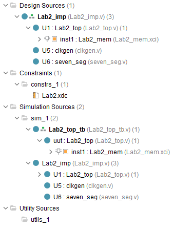
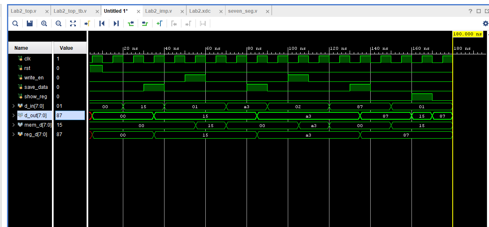
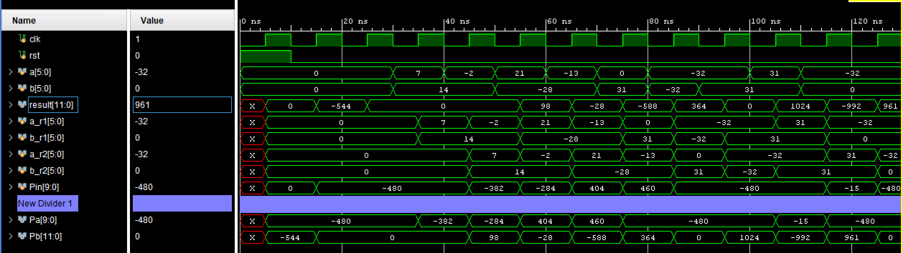
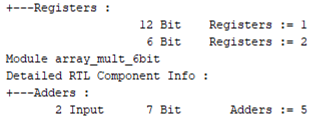
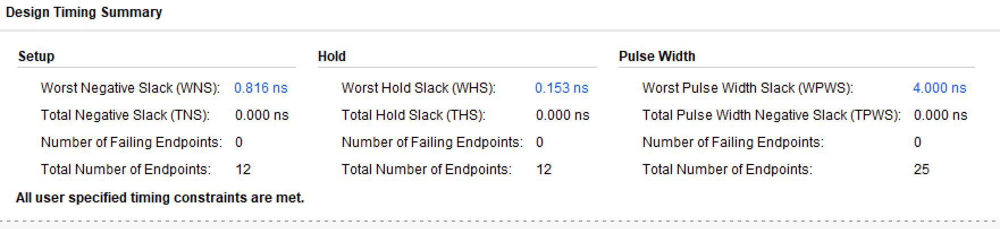
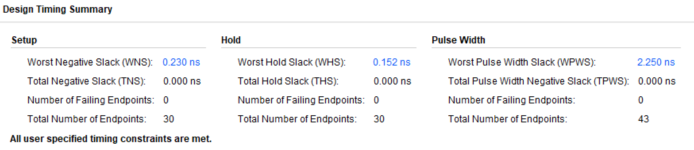
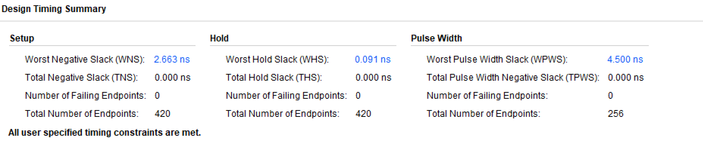
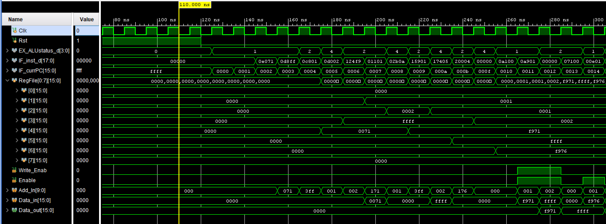
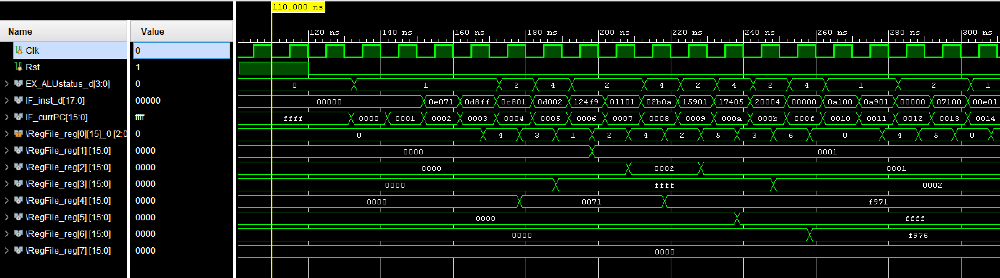

# CE2003-Labs
## Lab 1
https://github.com/jh0011/CE2003-Labs/tree/main/Lab_1 

Simple Vending Machine. Implement a FSM of a vending machine that can accept $1 coins and 50¢ coins. 

## Lab 2
https://github.com/jh0011/CE2003-Labs/tree/main/Lab_2

Memory Primitives. Instantiate a LUT-based distributed memory.

### How it works:
Certain 8-bit values can be stored in 6-bit user-defined address spaces. 

- Enable save_data to update the reg_d value. 

- Change d_in to either set the input to the flip-flop or to set the 6-bit address for Lab2_mem.

- Enable write_en to write the 8-bit reg_d value into the 6-bit memory address' location.

- To access the stored value in Lab2_mem, set the d_in to the address location, and enable show_reg.

## Lab 3
https://github.com/jh0011/CE2003-Labs/tree/main/Lab_3

Pipelined 2's complement array multiplier.

## Lab 4
https://github.com/jh0011/CE2003-Labs/tree/main/Lab_4

Pipelining and Datapaths

